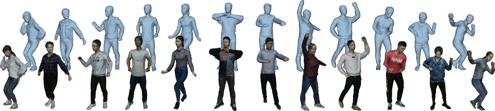
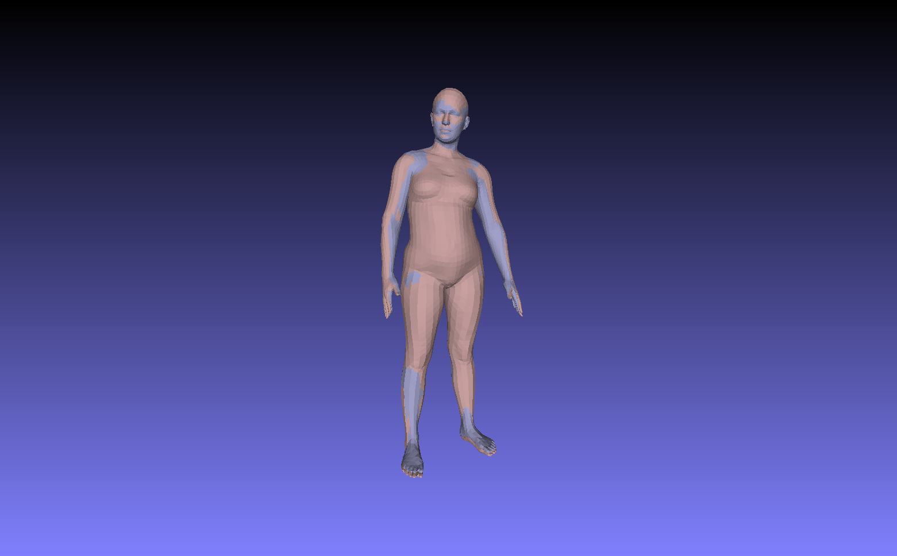

# THUman Dataset
### DeepHuman: 3D Human Reconstruction from a Single Image
Zerong Zheng, Tao Yu, Yixuan Wei, Qionghai Dai, Yebin Liu.  ICCV 2019

[[Project Page]](http://www.liuyebin.com/deephuman/deephuman.html)
[[Paper]](http://openaccess.thecvf.com/content_ICCV_2019/papers/Zheng_DeepHuman_3D_Human_Reconstruction_From_a_Single_Image_ICCV_2019_paper.pdf)




### Agreement
1. The THUman dataset (the "Dataset") is available for **non-commercial** research purposes only. Any other use, in particular any use for commercial purposes, is prohibited. This includes, without limitation, incorporation in a commercial product, use in a commercial service, as training data for a commercial product, for commercial ergonomic analysis (e.g. product design, architectural design, etc.), or production of other artifacts for commercial purposes including, for example, web services, movies, television programs, mobile applications, or video games. The dataset may not be used for pornographic purposes or to generate pornographic material whether commercial or not. The Dataset may not be reproduced, modified and/or made available in any form to any third party without Tsinghua University’s prior written permission.

2. You agree **not to** reproduce, modified, duplicate, copy, sell, trade, resell or exploit any portion of the images and any portion of derived data in any form to any third party without Tsinghua University’s prior written permission

3. You agree **not to** further copy, publish or distribute any portion of the Dataset. Except, for internal use at a single site within the same organization it is allowed to make copies of the dataset.

4. Tsinghua University reserves the right to terminate your access to the Dataset at any time.


### Download Instructions
The dataset are available at [this link](https://drive.google.com/open?id=12V1fWIfVkYcc9cR1vBhHgtNiupe1pp8H). The dataset is encrypted to prevent unauthorized access. Please fill the [request form](./agreement.pdf) and send it to Yebin Liu (liuyebin@mail.tsinghua.edu.cn) and cc Zerong Zheng (zrzheng1995@foxmail.com) to request the unzip password. By requesting for the password, you acknowledge that you have read the agreement, understand it, and agree to be bound by them. If you do not agree with these terms and conditions, you must not download and/or use the Dataset.


### Data Explanation
#### SMPL Parameters
We provide the SMPL mesh models (```smpl.obj```) as well as the the corresponding shape&pose parameters (```smpl_params.txt```)  in our dataset. 
In a SMPL parameter .txt file, three groups of coefficients are saved: shape parameters (LINE ```2```), root transformation(LINE ```4-7```) and joint rotations(LINE ```9-80```) . 
The 'shape parameters' correspond to ```betas``` in the SMPL model, while the 'joint rotations' correspond to ```thetas``` . 
The transformation matrix in 'Root Transformation' means the rotation and translation of the model around the original point of the coordinate system. 
This is different from the SMPL official code sample, in which the model is rotated around the root joint. 

Here is a piece of code showing how to use those parameters to generate a corresponding SMPL mesh: 
```python
## smpl_param_usage.py

from smpl_webuser.serialization import load_model
import numpy as np

## Read smpl parameter
with open('./data_sample/smpl_params.txt', 'r') as fp:
    lines = fp.readlines()
    lines = [l[:-2] for l in lines]     # remove '\r\n'
    
    betas_data = filter(lambda s: len(s)!=0, lines[1].split(' '))
    betas = np.array([float(b) for b in betas_data])
    
    root_mat_data = lines[3].split(' ') + lines[4].split(' ') +\
                    lines[5].split(' ') + lines[6].split(' ')
    root_mat_data = filter(lambda s: len(s)!=0, root_mat_data)
    root_mat = np.reshape(np.array([float(m) for m in root_mat_data]), (4, 4))
    root_rot = root_mat[:3, :3]
    root_trans = root_mat[:3, 3]

    theta_data = lines[8:80]
    theta = np.array([float(t) for t in theta_data])

## Load SMPL model (here we load the male model)
## Make sure path is correct
m = load_model( './smpl_webuser/basicModel_f_lbs_10_207_0_v1.0.0.pkl' )

## Apply shape & pose parameters
m.pose[:] = theta
m.betas[:] = betas

## Apply root transformation
verts = m.r
verts = np.matmul(verts, root_rot.transpose()) + np.reshape(root_trans, (1, -1))

```
Note that the generated SMPL mesh would be slightly different from the one we provided (see the figure below). 
This is because in the DoubleFusion capture system, the shape parameters are gradually optimized, and after each iteration of optimization, we add the delta translations to the previous SMPL vertices instead of recalculating the vertex positions. 
Consequently, rounding error accumulates as more and more frames are processed. 




#### Camera Parameters
TODO

### Citation
If you use this code for your research, please consider citing:
```
@InProceedings{Zheng2019DeepHuman, 
    author = {Zheng, Zerong and Yu, Tao and Wei, Yixuan and Dai, Qionghai and Liu, Yebin},
    title = {DeepHuman: 3D Human Reconstruction From a Single Image},
    booktitle = {The IEEE International Conference on Computer Vision (ICCV)},
    month = {October},
    year = {2019}
}
```

### Contact
- Zerong Zheng [(zrzheng1995@foxmail.com)](mailto:zrzheng1995@foxmail.com)
- Yebin Liu [(liuyebin@mail.tsinghua.edu.cn)](mailto:liuyebin@mail.tsinghua.edu.cn)
